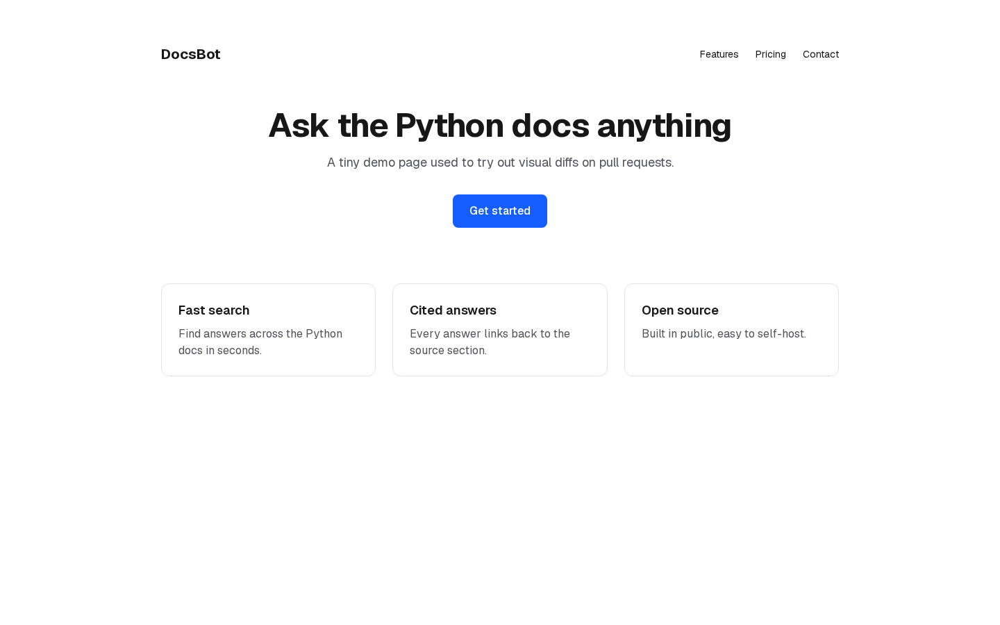
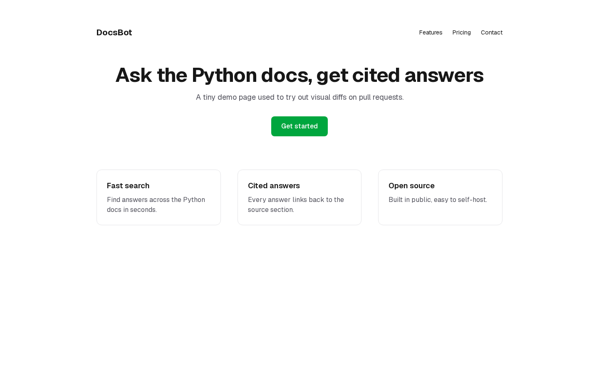
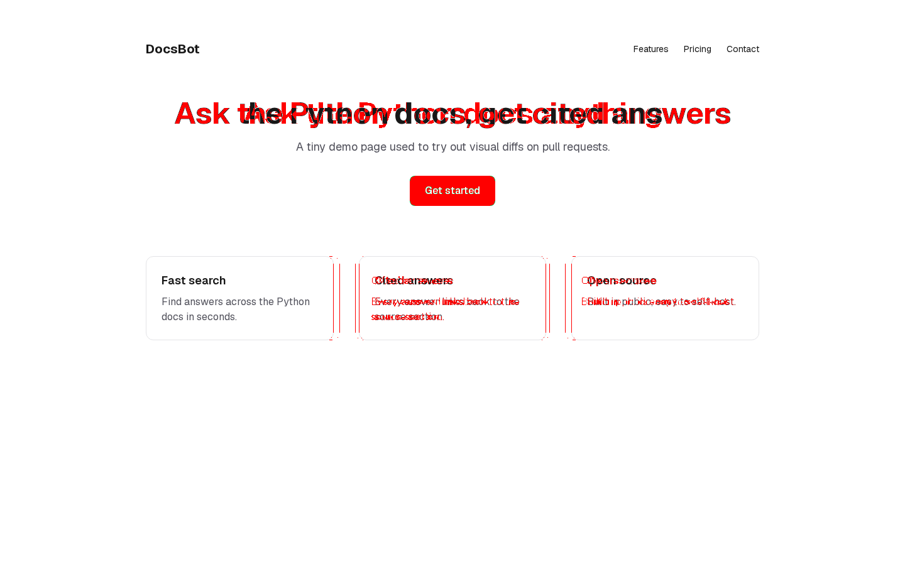

# ShiroDiff: what I tested, and how I'd help scale it

Hi Tarunya,

I'm Gowtham, an engineer moving into AI engineering. Before our call I installed ShiroDiff on this repo and ran it on a real pull request. This README covers what I saw, what I'd improve, and how I could help build and scale it.

**Short version:** ShiroDiff gets the hard part right: setup takes 30 seconds and a PR gets a report within a minute. What limits it now is the quality of the signal (the score passed a PR that changed the main button's colour) and trust (it runs unknown code and needs write access). Below is a step-by-step plan for both, and how I'd help build it.

---

## 1. What I tested

This repo is a small Next.js landing page. I installed ShiroDiff on this repo only and opened [PR #1](https://github.com/gowtham965/shirodiff-test/pull/1) with three deliberate changes:

| Change | Before | After |
|---|---|---|
| Headline text | "Ask the Python docs anything" | "Ask the Python docs, get cited answers" |
| Main button colour | Blue | Green |
| Space between the feature cards | `gap-6` (24px) | `gap-10` (40px) |

### What ShiroDiff reported

| | |
|---|---|
| Time from opening the PR to the full report | **About 40 seconds** (a "⏳ Analyzing…" placeholder appeared after 4 seconds) |
| Pages checked | 1 (`/`, detected automatically) |
| Pixel change | **1.54%** (20,008 of 1,296,000 pixels) |
| SSIM | **96.04%** |
| Composite score | **97.38%** |
| Result | 🔴 Changed |

| Before | After | Diff (changed pixels in red) |
|---|---|---|
|  |  |  |

It caught all three changes. This is one PR on one page, so treat these as first impressions, not a benchmark.

---

## 2. What I noticed

1. **The score would have let this PR through.** Your README calls a composite above 95% "usually safe", and this PR scored 97.38% even though the main call-to-action button changed colour completely. Changes that matter most often cover few pixels, so any score based on "how much of the page changed" will underrate them.
2. **A moved element looks the same as a changed one.** The cards shifted 16px sideways, and the diff paints both cards red as if their content had changed. The old and new headline text also overlap in red, which is hard to read. A reviewer has to open the before and after images and compare them by eye, which is the work the tool is meant to save.
3. **It needs write access to the repo.** Screenshots go to a `visualbot-assets` branch in my repo. Many companies won't give a new tool write access, even though read access would be enough if screenshots were stored elsewhere.
4. **It builds and runs unknown code.** `npm install` can run any script in a repo's `package.json`. At scale, every run needs to be isolated from the others and from your servers.
5. **Small polish:** the PR comment is still signed "VisualBot", and the footer mentions scores "ported from GodComet's visual auditor".

What already works well: setup takes 30 seconds with no config, it finds the pages to check automatically, it already does the slow work in the background (the "⏳ Analyzing…" comment appeared after 4 seconds and was replaced with the results about 36 seconds later), the results come back fast, and the report arrives as a PR comment so every reviewer sees it.

---

## 3. How ShiroDiff works today

```
PR opened or updated
  → GitHub webhook
  → build the base branch and the PR branch (npm install, npm run dev)
  → Playwright screenshot of each page at 1440×900
  → pixelmatch + SSIM → diff image + scores
  → PR comment with before / after / diff
```

---

## 4. How I'd help scale and build it

These are ordered by what breaks first as more teams install it. Each step is a piece of work I could take on.

### Step 1: A safe, reliable runner
- **Make sure the background work runs on a durable queue.** ShiroDiff already answers GitHub fast and builds in the background. What I can't see from outside is *how*. If builds run as tasks inside the web server, a burst of PRs lands on one machine, and a restart mid-build leaves PRs stuck on "Analyzing…" forever. A durable job queue with separate workers keeps jobs through restarts, retries failures, and lets you add workers as traffic grows. If this is already in place, this step is done.
- Handle stuck jobs: if a build hangs or a worker dies, time it out and update the PR comment with a clear error instead of leaving "Analyzing…" up.
- Run each build in a **fresh container that is deleted afterwards**, with CPU, memory and time limits, and with the network switched off once dependencies are installed.
- Report a **GitHub check** (pending, pass or fail) alongside the comment, so teams can require it before merging.
- Record, for every run, how long it took, whether it succeeded, and why it failed. This data should drive the rest of the roadmap.

### Step 2: Cheaper and faster runs
- **Screenshot preview deploys when they exist.** Many Next.js teams already get a Vercel or Netlify preview link per PR. ShiroDiff could listen for GitHub's deployment events and screenshot that link, skipping the build entirely. That's much cheaper, and it works with any framework.
- **Cache dependencies** based on the lockfile, so `npm install` doesn't run from scratch every time.
- **Reuse screenshots of the base branch.** `main` rarely changes between PRs, so save its screenshots per commit and share them across PRs.

### Step 3: Work on real-world repos
- Detect the framework, the package manager and the app's folder automatically: Vite, Remix, Nuxt and monorepos where the app lives in `apps/web` or `frontend/`.
- Add an optional `.shirodiff.yml` for pages to check, screen sizes, environment variables and test logins. **Most real apps won't start without env vars or a database,** so this is likely the biggest cause of failed runs.

### Step 4: A better signal: compare elements, not only pixels
This addresses points 1 and 2 above.
- **Use the page structure.** Playwright can read each element's position, size, text and styles. Comparing before and after element by element shows exactly what happened: "moved 16px right", "colour changed", "text changed". It also shows when a card only moved and its contents didn't change.
- **Group changed pixels into regions** and score each region by importance. A button, a headline or anything above the fold counts for more than a footer, so a small but important change can't hide behind a high overall score.
- Reduce false alarms: turn off animations, wait for fonts and network requests to finish, hide areas that always change (dates, ads, avatars), and let teams set their own thresholds.

### Step 5: AI change summaries, measured properly
This is on your roadmap, and it's where my background fits best. The goal is one line per change at the top of the PR comment, for example: *"Get started button: blue → green. Headline reworded. Feature cards 16px further apart."*

**Where it fits:** after the regions are found (see the [prototype](#5-a-working-prototype-scoring-each-region)), make one call to a vision model:

```
screenshots → pixelmatch → changed regions + measured facts
                                   │
                                   ▼
        top ~5 regions: before crop + after crop + facts → vision model
                                   │
                                   ▼
        structured JSON: { overall, regions: [{ id, change, risk }] }
                                   │
                                   ▼
                 summary lines added to the top of the PR comment
```

**Give the model facts, not just pictures.** Given only two full-page screenshots, a model has to guess what changed and will sometimes invent changes. Instead, send:
- small **before and after crops** of each changed region. They're cheap, and the model can see the detail clearly.
- the **measured facts** for each region: position, severity, kind, exact colours (`#155dfc → #00a63e`) and, after step 4, element-level changes such as "moved 16px right".
- a strict instruction to describe only those regions.

The model's job is then to turn measurements that can be trusted into plain English, not to find the changes itself.

**Fixed output format.** The model returns JSON that must match a schema (an overall sentence, plus a change and a risk level per region). The comment builder can use it directly, and a malformed reply is caught instead of posted.

**Rough cost per PR.** About 5 regions × 2 crops plus the facts comes to roughly 2,000–5,000 input tokens and about 300 output tokens. Using Claude models at current list prices as an example:

| Model | Approx. per PR | Per 100k PRs |
|---|---|---|
| Claude Opus 5 | ~$0.02–0.035 | ~$2,000–3,500 |
| Claude Sonnet 5 | ~$0.01 | ~$1,000 |
| Claude Haiku 4.5 | ~$0.005 | ~$500 |

Sending full screenshots instead of crops adds about 1,700 tokens per image. The model should be chosen on measured accuracy, not price alone, and a paid tier covers the cost.

**Measure it, which is the part most tools skip.** An AI summary is only useful if reviewers trust it.
1. Collect 20–30 real PRs and write down what actually changed in each.
2. For each summary, check how many real changes it mentions and how many it invents.
3. Compare crops versus full screenshots, different prompts and different models on the same set, and ship whichever wins.

**Guardrails:**
- If the AI call fails or times out, post the normal visual report without the summary. A PR should never be blocked because the model was down.
- Summarise only regions above "minor", cap it at about 5 per PR, and skip PRs with no changes, to keep costs predictable.
- Sending customer screenshots to an AI provider should be opt-in and stated on the security page. Many companies will ask about it.
- Rate each change by how serious it is (layout break, style change, text change), so teams can auto-approve PRs that only have small changes.

### Step 6: Trust and growth
- **Ask for read-only access** by storing screenshots in ShiroDiff's own storage instead of the user's repo.
- Publish a short security page covering isolation, what is stored and for how long, and consider open-sourcing the runner. Companies will need this before installing it on private code.
- **Every PR comment is advertising.** Add a "Powered by ShiroDiff" link and list the app on GitHub Marketplace.
- Keep public repos free, and charge for private repos, teams, extra pages and screen sizes, and AI summaries.

---

## 5. A working prototype: scoring each region

To show the fix for point 1 is practical, I built a small tool ([`tools/region-score`](tools/region-score)) and ran it on the same before and after screenshots ShiroDiff produced for PR #1. It finds each separate changed area, scores each one on how much of it changed and how strongly its colours shifted, and lets the worst area decide.

| | Today (whole page) | Region scoring |
|---|---|---|
| Verdict | 97.4% composite → **looks safe** | 🔴 **Needs review** |
| Button | lost in the average | Region 2, severity **0.96**: colour change `#155dfc` → `#00a63e` |
| Headline | lost in the average | Region 1, severity **0.52**: text change |
| Cards that only moved | shown fully red | 🟠 minor (0.19–0.23) or ✅ no meaningful change (0.06–0.07) |


Full output: [report.md](docs/pr-1/region-score/report.md). It runs in about 0.3 seconds on a 1440×900 pair and uses the same libraries as ShiroDiff (pixelmatch + pngjs), so it could slot in right after the existing comparison step. It doesn't yet tell "moved" apart from "changed"; that needs element positions from the page (step 4).

---

## 6. How I can contribute, concretely

Until I have access to the code, I'd build each piece as a **standalone tool that works on what ShiroDiff already produces** (its screenshots on the `visualbot-assets` branch) or on my own Playwright screenshots, as the region-score prototype does. Then I'd show you the results and help plug it in.

### 1. Fix the score problem ✅ prototype done
- **Done:** [`tools/region-score`](tools/region-score). On PR #1 it turns "97.4%, looks safe" into "needs review: the button changed colour".
- **Next:** run it on more PRs so it isn't a one-off. One PR with a harmless change (a typo fix in small text) should come out as "minor", and one with a real break (a broken card layout) should come out as "needs review". Both results get added to the table in section 5, to show it catches real problems without raising false alarms.
- **Effort:** about 1 hour.

### 2. Say what changed, not just where
- **Build:** `tools/element-diff`, a Playwright script that:
  1. starts the site at the old commit and the new one (the same `npm run dev` ShiroDiff uses),
  2. records every visible element's position, size, text and key styles (background colour, text colour, font size),
  3. matches elements across the two versions by their place in the page structure plus their text,
  4. reports the differences: "button: background blue → green", "card 2: moved 16px right", "h1: text changed".
- **Then:** feed its output into region-score, so a region that only moved is labelled "moved", not "changed".
- **Effort:** a weekend.

### 3. AI summaries, built the right way
- **Build, in this order:**
  1. **The test set first:** 15–20 PRs covering different kinds of change (colour, text, spacing, a layout break, a harmless change, nothing changed), each with the correct answer written down in `cases.json`.
  2. **The summariser:** region crops plus the facts from 1 and 2, sent to a vision model, returning JSON (the design in step 5 of section 4).
  3. **The scorer:** compare each summary against the correct answers, and count how many real changes it caught and how many it made up.
- **Result to share:** a small table, e.g. "caught 18/20 real changes, invented 1", for two setups (crops only versus crops + facts) to prove the design choice with data.
- **Effort:** about a week. A full run over 20 PRs costs well under $1 in model calls.

### 4. Widen who can use it
- **Test now:** run ShiroDiff on repos that aren't Next.js and record exactly what happens: a Vite app in a subfolder (e.g. `frontend/`), a plain Vite + React app at the root, and a monorepo with the app in `apps/web`. I'd write up what works, what fails, and the error message ShiroDiff shows.
- **Fix, with code access:** detect the framework and the app's folder by reading `package.json` (`next`, `vite`, …) and looking in common subfolders, then pick the right start command.
- **Effort:** 1–2 hours of testing. The fix itself needs the codebase.

### 5. Help beyond code
- **Bug reports:** file the issues from section 2 on the ShiroDiff repo: the "VisualBot" name, 1440×900 screenshots when the README promises full-page, and the composite passing a colour change (with the region-score results). Each report would say what I did, what happened, what I expected, and include a screenshot.
- **Security page draft:** a one-page `SECURITY.md` covering what code is run, where it runs, what's stored and for how long, which permissions it needs and why, and how to uninstall.
- **Effort:** 1–2 hours.

### Suggested order
1. **Right away:** more PRs for #1 and bug reports for #5. Low effort, and useful straight away.
2. **Next:** non-Next.js testing for #4, so we know which frameworks to support first.
3. **First real projects:** #2 and #3 together. The element diff makes the AI summaries accurate, and the test set proves it. I'd share results and example PR comments with you before building anything bigger.

---

Thanks for reading. I'd love to help build this.

**Gowtham Gowda** · [github.com/gowtham965](https://github.com/gowtham965)

---

<sub>About this repo: a small Next.js page used only to test ShiroDiff. Run it with `npm install && npm run dev`.</sub>
