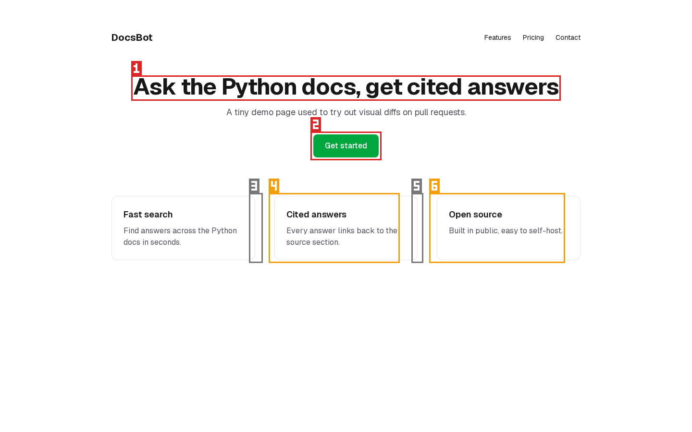
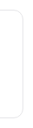
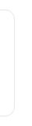
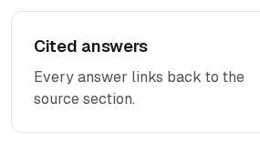
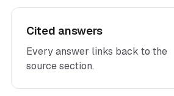
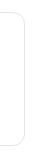
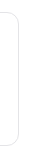

## Region report

**Whole-page composite (how ShiroDiff scores today): 97.41%** → looks safe (above the 95% line)
Pixel change 1.54% · SSIM 96.09% · Pixel sim 98.73%

**Region scoring: 🔴 Needs review** · worst is region 2 (severity 0.96)

| # | Region (x, y, w×h) | Changed pixels | Colour shift (ΔE) | Severity | Likely |
|---|---|---|---|---|---|
| 1 | 279, 163, 882×41 | 27.00% of region | 91.9 | 🔴 0.52 | text or layout change |
| 2 | 652, 280, 136×48 | 91.00% of region | 160.9 | 🔴 0.96 | colour change (#155dfc → #00a63e) |
| 3 | 524, 408, 17×134 | 10.00% of region | 9.5 | ✅ 0.06 | text or layout change |
| 4 | 565, 408, 261×134 | 6.00% of region | 46.1 | 🟠 0.23 | text or layout change |
| 5 | 862, 408, 13×134 | 13.00% of region | 9.5 | ✅ 0.07 | text or layout change |
| 6 | 899, 408, 271×134 | 4.00% of region | 47 | 🟠 0.19 | text or layout change |

| # | Before | After |
|---|---|---|
| 1 |  |  |
| 2 |  |  |
| 3 |  |  |
| 4 |  |  |
| 5 |  |  |
| 6 |  |  |

Severity = √(share of the region that changed) × (colour shift ÷ 50, capped at 1). ≥ 0.30 needs review · ≥ 0.10 minor.
