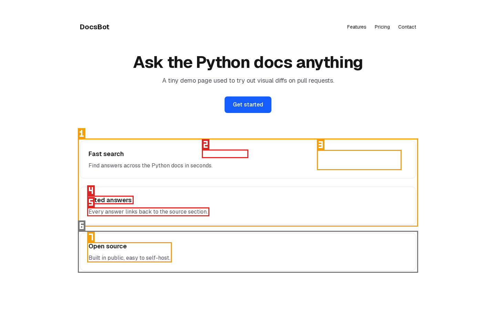
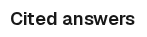
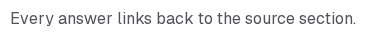
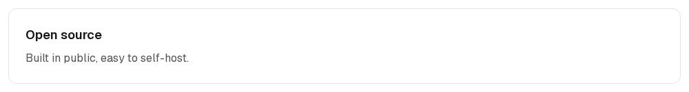

## Region report

**Whole-page composite (how ShiroDiff scores today): 96.82%** → looks safe (above the 95% line)
Pixel change 0.86% · SSIM 94.08% · Pixel sim 99.55%

**Region scoring: 🔴 Needs review** · worst is region 2 (severity 0.53)

| # | Region (x, y, w×h) | Changed pixels | Colour shift (ΔE) | Severity | Likely |
|---|---|---|---|---|---|
| 1 | 232, 408, 976×244 | 3.00% of region | 34.5 | 🟠 0.13 | text or layout change |
| 2 | 592, 440, 123×13 | 28.00% of region | 84.8 | 🔴 0.53 | text or layout change |
| 3 | 926, 441, 234×47 | 8.00% of region | 68.2 | 🟠 0.28 | text or layout change |
| 4 | 259, 574, 123×13 | 28.00% of region | 84.8 | 🔴 0.53 | text or layout change |
| 5 | 259, 608, 343×14 | 16.00% of region | 53.4 | 🔴 0.40 | text or layout change |
| 6 | 232, 676, 976×110 | 3.00% of region | 26.8 | ✅ 0.09 | text or layout change |
| 7 | 259, 709, 234×47 | 8.00% of region | 68.2 | 🟠 0.28 | text or layout change |

| # | Before | After |
|---|---|---|
| 1 |  |  |
| 2 |  |  |
| 3 |  |  |
| 4 |  |  |
| 5 |  |  |
| 6 |  |  |
| 7 |  |  |

Severity = √(share of the region that changed) × (colour shift ÷ 50, capped at 1). ≥ 0.30 needs review · ≥ 0.10 minor.
