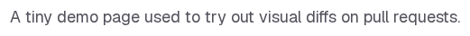
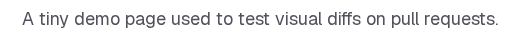
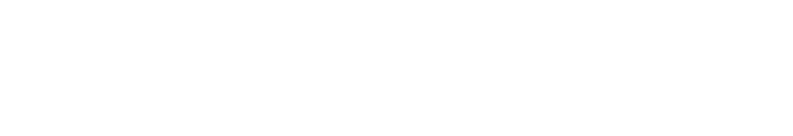
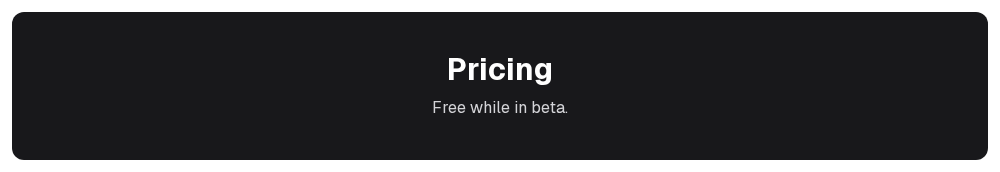

## Region report

**Whole-page composite (how ShiroDiff scores today): 93.36%** → needs a look (below 95%)
Pixel change 6.91% · SSIM 92.95% · Pixel sim 93.77%

**Region scoring: 🔴 Needs review** · worst is region 2 (severity 0.99)

| # | Region (x, y, w×h) | Changed pixels | Colour shift (ΔE) | Severity | Likely |
|---|---|---|---|---|---|
| 1 | 472, 227, 497×16 | 25.00% of region | 47.2 | 🔴 0.47 | text or layout change |
| 2 | 232, 1242, 976×148 | 99.00% of region | 91.5 | 🔴 0.99 | colour change (#ffffff → #18181b) |

| # | Before | After |
|---|---|---|
| 1 |  |  |
| 2 |  |  |

Severity = √(share of the region that changed) × (colour shift ÷ 50, capped at 1). ≥ 0.30 needs review · ≥ 0.10 minor.
