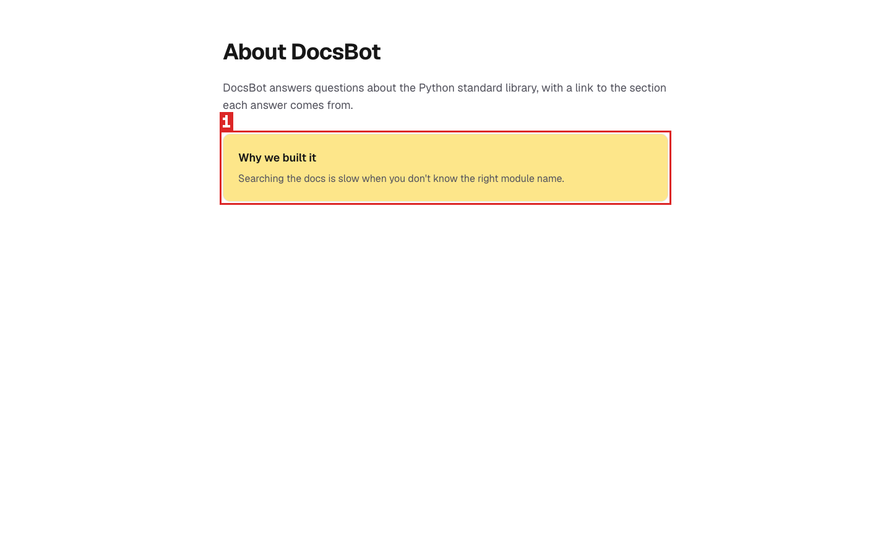
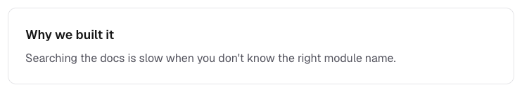
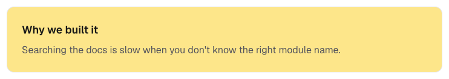

## Region report

**Whole-page composite (how ShiroDiff scores today): 99.02%** → looks safe (above the 95% line)
Pixel change 5.69% · SSIM 99.14% · Pixel sim 98.91%

**Region scoring: 🔴 Needs review** · worst is region 1 (severity 0.94)

| # | Region (x, y, w×h) | Changed pixels | Colour shift (ΔE) | Severity | Likely |
|---|---|---|---|---|---|
| 1 | 361, 217, 718×108 | 95.00% of region | 48.4 | 🔴 0.94 | colour change (#ffffff → #fde68a) |

| # | Before | After |
|---|---|---|
| 1 |  |  |

Severity = √(share of the region that changed) × (colour shift ÷ 50, capped at 1). ≥ 0.30 needs review · ≥ 0.10 minor.
